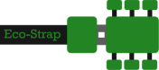

# Eco-Strap Website
## -Development for Eco-Strap UF Webpage

This website was created for the purpose of serving as an online webshop for my school company.    
  
    

  
The website is still under development. The prototype is currently being developed in this branch. Later the prototype will go in to the main branch. The main branch will then contain a reactive and responsive website with standarized code, use of the skeleton library and react for js site management. It may contain JQuery.

This no javascript version is now done.
  

>[Visit our company instagram to learn more.](https://www.instagram.com/ecostrapuf/) 

>[Visit our website as well.](https://eco-strap.store/)

## Logo

